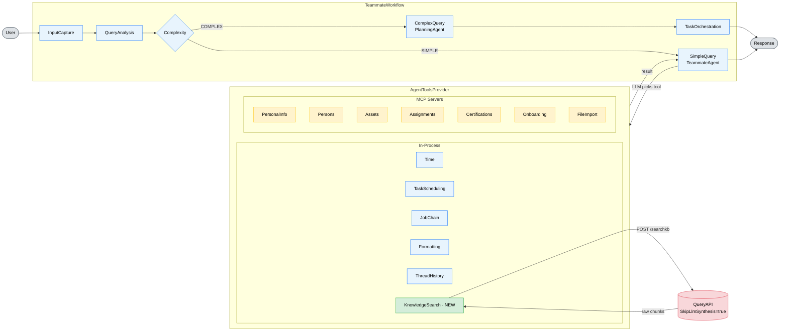

```mermaid
flowchart LR
    User([User])

    subgraph Workflow[TeammateWorkflow]
        direction TB
        IC[InputCapture]
        QA[QueryAnalysis]
        CR{Complexity}
        SQ[SimpleQuery\nTeammateAgent]
        CQ[ComplexQuery\nPlanningAgent]
        TO[TaskOrchestration]
    end

    subgraph Tools[AgentToolsProvider]
        direction TB
        subgraph InProcess[In-Process]
            TT[Time]
            TS[TaskScheduling]
            JC[JobChain]
            FT[Formatting]
            TH[ThreadHistory]
            KT[KnowledgeSearch - NEW]
        end
        subgraph MCP[MCP Servers]
            P[PersonalInfo]
            PE[Persons]
            A[Assets]
            AS[Assignments]
            C[Certifications]
            O[Onboarding]
            FI[FileImport]
        end
    end

    QueryAPI[(QueryAPI\nSkipLlmSynthesis=true)]
    Out([Response])

    User --> IC
    IC --> QA
    QA --> CR
    CR -->|SIMPLE| SQ
    CR -->|COMPLEX| CQ
    CQ --> TO
    TO --> Out
    SQ -->|LLM picks tool| Tools
    Tools -->|result| SQ
    SQ --> Out
    KT -->|POST /searchkb| QueryAPI
    QueryAPI -->|raw chunks| KT

    classDef newNode fill:#d4edda,stroke:#28a745,color:#000
    classDef existingNode fill:#e8f4fd,stroke:#0d6efd,color:#000
    classDef mcpNode fill:#fff3cd,stroke:#ffc107,color:#000
    classDef extNode fill:#f8d7da,stroke:#dc3545,color:#000
    classDef io fill:#dee2e6,stroke:#6c757d,color:#000

    class KT newNode
    class IC,QA,CR,SQ,CQ,TO,TT,TS,JC,FT,TH existingNode
    class P,PE,A,AS,C,O,FI mcpNode
    class QueryAPI extNode
    class User,Out io
```
