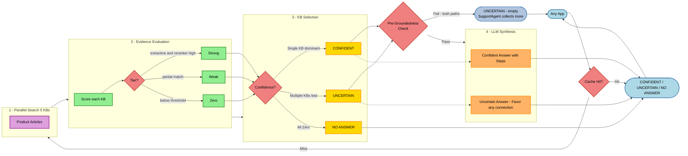

```mermaid
flowchart LR
    Client([Any App])
    Cache{Cache Hit?}

    subgraph Search[1 - Parallel Search 5 KBs]
        direction TB
        KAB[Product Articles]
    end

    subgraph Evidence[2 - Evidence Evaluation]
        direction TB
        Score[Score each KB]
        Tier{Tier?}
        Strong[Strong]
        Weak[Weak]
        Zero[Zero]
    end

    subgraph Selection[3 - KB Selection]
        direction TB
        Sel{Confidence?}
        C[CONFIDENT]
        U[UNCERTAIN]
        N[NO ANSWER]
    end

    PGC{Pre-Groundedness\nCheck}
    CollectMore([UNCERTAIN - empty\nSupportAgent collects more])

    subgraph Synthesis[4 - LLM Synthesis]
        direction TB
        SC[Confident Answer with Steps]
        SU[Uncertain Answer - Favor any connection]
    end

    Resp([CONFIDENT / UNCERTAIN / NO ANSWER])

    Client --> Cache
    Cache -->|Hit| Resp
    Cache -->|Miss| Search

    Search --> Evidence
    Score --> Tier
    Tier -->|extractive and reranker high| Strong
    Tier -->|partial match| Weak
    Tier -->|below threshold| Zero

    Evidence --> Selection
    Strong --> Sel
    Weak --> Sel
    Zero --> Sel
    Sel -->|Single KB dominant| C
    Sel -->|Multiple KBs tied| U
    Sel -->|All Zero| N

    C --> PGC
    U --> PGC
    N --> Resp

    PGC -->|Pass| Synthesis
    PGC -->|Fail - both paths| CollectMore

    C -.-> SC
    U -.-> SU
    SC --> Resp
    SU --> Resp
    Resp --> Client
    CollectMore --> Client

    classDef clientStyle fill:#ADD8E6,stroke:#4682B4,stroke-width:2px,color:#000
    classDef searchStyle fill:#DDA0DD,stroke:#8B008B,stroke-width:2px,color:#000
    classDef evalStyle fill:#90EE90,stroke:#228B22,stroke-width:2px,color:#000
    classDef selStyle fill:#FFD700,stroke:#FF8C00,stroke-width:2px,color:#000
    classDef synthStyle fill:#FFB366,stroke:#FF8C00,stroke-width:2px,color:#000
    classDef decisionStyle fill:#f08080,stroke:#c0392b,stroke-width:2px,color:#000
    classDef collectStyle fill:#B0C4DE,stroke:#4682B4,stroke-width:2px,color:#000

    class Client,Resp clientStyle
    class KAB,WO,Sec,Tim,Dev searchStyle
    class Score,Strong,Weak,Zero evalStyle
    class C,U,N selStyle
    class SC,SU synthStyle
    class Cache,Tier,Sel,PGC decisionStyle
    class CollectMore collectStyle

```
